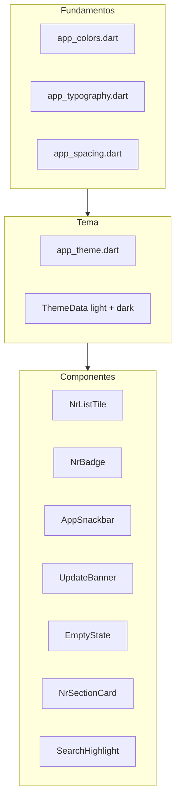

# NR Fácil — Design System

Especificação técnica de tokens, componentes e padrões de implementação Flutter.  
Identidade de marca e tom de voz: [brand.md](brand.md).

---

## 1. Arquitetura

```
app/lib/core/theme/
  app_colors.dart                ← constantes de cor + semantic colors
  app_typography.dart            ← TextTheme com Inter
  app_spacing.dart               ← grid 4px (AppSpacing, AppRadius)
  app_semantic_colors.dart       ← ThemeExtension (badges, highlights)
  app_theme.dart                 ← ThemeData light + dark
  app_theme_extensions.dart      ← helpers de contexto

app/lib/core/controllers/
  theme_controller.dart          ← ThemeMode system/light/dark + persistência

app/lib/features/settings/views/
  settings_page.dart             ← tela de Ajustes (tema + sobre)
```

O tema global é aplicado em `main.dart` via `GetMaterialApp` (`theme`, `darkTheme`, `themeMode`). O leitor reutiliza o mesmo tema; o toggle no leitor delega ao `ThemeController`.



---

## 2. Tokens de cor

### 2.1 Light mode — mapeamento `ColorScheme`

| Token design | Hex | Propriedade `ColorScheme` |
|--------------|-----|---------------------------|
| primary | `#0F5C4E` | `primary` |
| onPrimary | `#FFFFFF` | `onPrimary` |
| primaryContainer | `#D4EDE6` | `primaryContainer` |
| onPrimaryContainer | `#0A3D34` | `onPrimaryContainer` |
| secondary | `#1E3A5F` | `secondary` |
| onSecondary | `#FFFFFF` | `onSecondary` |
| surface | `#FAFBFC` | `surface` |
| onSurface | `#1A1C1E` | `onSurface` |
| onSurfaceVariant | `#4A5560` | `onSurfaceVariant` |
| surfaceContainer | `#F0F2F4` | `surfaceContainer` / `surfaceContainerLow` |
| surfaceContainerHigh | `#E8EAED` | `surfaceContainerHigh` |
| surfaceBright | `#FFFFFF` | `surfaceContainerHighest` |
| outline | `#B0BAC4` | `outline` |
| error | `#C62828` | `error` |
| onError | `#FFFFFF` | `onError` |

### 2.2 Dark mode — mapeamento `ColorScheme`

| Token design | Hex | Propriedade `ColorScheme` |
|--------------|-----|---------------------------|
| primary | `#4DB6A0` | `primary` |
| onPrimary | `#0A3D34` | `onPrimary` |
| primaryContainer | `#0F5C4E` | `primaryContainer` |
| onPrimaryContainer | `#D4EDE6` | `onPrimaryContainer` |
| surface | `#121212` | `surface` |
| onSurface | `#E8EAED` | `onSurface` |
| onSurfaceVariant | `#B8BFC6` | `onSurfaceVariant` |
| surfaceContainer | `#1E1E1E` | `surfaceContainer` |
| surfaceContainerHigh | `#2A2A2A` | `surfaceContainerHigh` / `surfaceContainerHighest` |
| outline | `#6E7A85` | `outline` |
| error | `#EF5350` | `error` |

### 2.3 Cores semânticas (fora do `ColorScheme`)

Estender via classe `AppColors` ou `ThemeExtension`:

| Token | Light | Dark | Uso |
|-------|-------|------|-----|
| success | `#2E7D4F` | `#66BB6A` | Snackbar sucesso, ícone verificado |
| warning | `#B45309` | `#FFB74D` | Texto de aviso |
| warningContainer | `#FEF3C7` | `#4A3F1A` | Badge atualização, fundo de aviso |
| onWarningContainer | `#92400E` | `#FFD180` | Texto sobre warningContainer |
| info | `#1565A8` | `#64B5F6` | Links PDF, ícones informativos |
| infoContainer | `#E3F0FA` | `#1A2F42` | Fundo UpdateBanner |
| onInfoContainer | `#0D4A7A` | `#90CAF9` | Texto/CTA sobre infoContainer |
| searchHighlight | `#FFF3CD` | `#5C4A1A` | Destaque de busca (fundo) |
| onSearchHighlight | `#1A1C1E` | `#FFE082` | Texto sobre searchHighlight |
| revoked | `#5C6670` | `#9E9E9E` | Badge NR revogada |
| muted | `#6B7280` | `#9AA0A6` | Texto atenuado (NR revogada em lista) |

### 2.4 Exemplo de implementação Flutter

```dart
// app/lib/core/theme/app_colors.dart
abstract final class AppColors {
  static const primary = Color(0xFF0F5C4E);
  static const primaryDark = Color(0xFF4DB6A0);
  static const success = Color(0xFF2E7D4F);
  static const warning = Color(0xFFB45309);
  static const warningContainer = Color(0xFFFEF3C7);
  static const info = Color(0xFF1565A8);
  static const infoContainer = Color(0xFFE3F0FA);
  // ...
}

// app/lib/core/theme/app_theme.dart
ThemeData buildLightTheme() {
  return ThemeData(
    useMaterial3: true,
    colorScheme: const ColorScheme.light(
      primary: AppColors.primary,
      onPrimary: Color(0xFFFFFFFF),
      primaryContainer: Color(0xFFD4EDE6),
      onPrimaryContainer: Color(0xFF0A3D34),
      secondary: Color(0xFF1E3A5F),
      surface: Color(0xFFFAFBFC),
      onSurface: Color(0xFF1A1C1E),
      onSurfaceVariant: Color(0xFF5C6670),
      outline: Color(0xFFC5CDD4),
      error: Color(0xFFC62828),
    ),
    textTheme: AppTypography.textTheme,
  );
}
```

---

## 3. Tokens de tipografia

### 3.1 Configuração

- Pacote: `google_fonts`
- Família: `GoogleFonts.interTextTheme()`

### 3.2 Mapeamento `TextTheme`

| Token | `TextTheme` | Size | Weight | Height |
|-------|-------------|------|--------|--------|
| displaySmall | `displaySmall` | 28 | 600 | 1.2 |
| titleLarge | `titleLarge` | 20 | 600 | 1.3 |
| titleMedium | `titleMedium` | 16 | 600 | 1.4 |
| bodyLarge | `bodyLarge` | 16 | 400 | 1.5 |
| bodyMedium | `bodyMedium` | 14 | 400 | 1.5 |
| bodySmall | `bodySmall` | 12 | 400 | 1.4 |
| labelMedium | `labelMedium` | 12 | 600 | 1.3 |

### 3.3 Leitor — escala relativa

Faixa fixa em `nr_reader_controller.dart`: **14 / 16 / 18 / 20 px** (padrão 16). Valores legados &lt; 14 migram para 14.

```dart
TextStyle readerHeading1(double base) =>
    TextStyle(fontSize: base + 2, fontWeight: FontWeight.w600, height: 1.3);
TextStyle readerBody(double base) =>
    TextStyle(fontSize: base, height: 1.6);
```

Layout contínuo: seções normativas sem cards (`NrSectionBlock`); preâmbulo e banner de atualização são os únicos blocos colapsáveis/especiais.

---

## 4. Tokens de espaçamento e forma

### 4.1 Espaçamento (grid 4px)

```dart
abstract final class AppSpacing {
  static const double xs = 4;
  static const double sm = 8;
  static const double md = 16;
  static const double lg = 24;
  static const double xl = 32;
}
```

| Token | Valor | Uso |
|-------|-------|-----|
| xs | 4 | Gap entre badge e texto |
| sm | 8 | Padding interno de chip |
| md | 16 | Padding padrão de tela/card, contentPadding de listas |
| lg | 24 | Separação de seções |
| xl | 32 | Estados vazios, margem superior de empty state |

### 4.2 Border radius

```dart
abstract final class AppRadius {
  static const double sm = 8;   // inputs, chips
  static const double md = 12;  // cards, snackbar, section cards
  static const double lg = 16;  // dialogs, bottom sheets
  static const double full = 999; // badge notificação (pill)
}
```

### 4.3 Elevação

- Cards: flat + borda `outline` 1px (sem sombra)
- AppBar: `elevation: 1`
- FAB: `elevation: 2`
- Snackbar: sem elevação; usar `surfaceContainerHigh` + `radius.md`

---

## 5. Componentes

### 5.1 NrListTile

**Arquivo:** `app/lib/features/home/views/widgets/nr_list_tile.dart`

Layout em duas colunas: bloco de texto à esquerda (label → título → badges) e ações à direita alinhadas ao topo.

| Elemento | Token |
|----------|-------|
| Label NR | `titleSmall`, `primary` (revogada: `onSurfaceVariant`) |
| Título | `bodyMedium`, `onSurface` (sempre legível), gap de 2px abaixo do label |
| Padding | horizontal `md`, vertical 12px |
| Ações | `NrTileIconButton` — 48dp, coluna à direita, paralelas ao label |
| Badge atualização | `NrBadge` variant `update` — label "Atualização disponível" |
| Badge revogada | `NrBadge` variant `revoked` |
| Download offline | `NrDownloadAction` — oculto se já baixada |
| Estrela favorito | 48dp, `AnimatedSwitcher`, sem SnackBar |

**Estados:**

| Estado | Comportamento visual |
|--------|---------------------|
| Normal | Título `onSurface`, label `primary` |
| Revogada | Título legível + badge; sem badge "Atualização disponível" |
| Com atualização | Chip "Atualização disponível" |
| Não baixada | Ícone download acionável (bottom sheet + Baixar) |

### 5.2 NrBadge (novo — abstrair de inline)

Componente reutilizável para substituir badges inline e emoji 🆕.

| Variante | Fundo | Texto | Label |
|----------|-------|-------|-------|
| `update` | `warningContainer` | `onWarningContainer` | "Atualização disponível" |
| `revoked` | `surfaceContainerHigh` | `revoked` | "Revogada" |
| `downloaded` | `primaryContainer` | `onPrimaryContainer` | "Baixada" | ✅ |

- Padding: horizontal `sm`, vertical `xs`
- Radius: `radius.sm`
- Tipografia: `labelMedium`

### 5.3 ContinuarLeituraCard

**Arquivo:** `app/lib/features/home/views/widgets/continuar_leitura_card.dart`

| Elemento | Token |
|----------|-------|
| Fundo | `surfaceContainer` |
| Radius | `radius.md` |
| Label "Continuar leitura" | `bodyMedium`, `onSurfaceVariant` |
| Título NR | `titleMedium`, `onSurface` |
| Margem | horizontal `md`, vertical `sm` |

### 5.4 AppSnackbar

**Arquivo:** `app/lib/core/widgets/app_snackbar.dart`

| Elemento | Token |
|----------|-------|
| Fundo | `surfaceContainerHigh` |
| Radius | `radius.md` |
| Ícone sucesso | `success` |
| Ícone aviso | `warning` |
| Ícone erro | `error` |
| Texto | `bodyMedium`, `onSurface` |

Substituir `Colors.green.shade600` e `Colors.orange.shade700` por tokens semânticos.

### 5.5 UpdateBanner

**Arquivo:** `app/lib/features/reader/views/widgets/update_banner.dart`

| Elemento | Token |
|----------|-------|
| Fundo light | `infoContainer` |
| Fundo dark | `infoContainer` (variante dark `#1A2F42`) |
| Borda | 1px `info` |
| Título | `bodyMedium` semibold, `onSurface` |
| CTA "Ver o que mudou" | `info`, `labelMedium` |
| Ícone fechar | `onSurfaceVariant` |

Substituir `Colors.blue[50/700/900]` por tokens `info` / `infoContainer`.

### 5.6 EmptyState

Padrão unificado para estados vazios (favoritos, atualizações, busca).

| Elemento | Token |
|----------|-------|
| Ícone | 64dp, `onSurfaceVariant` |
| Título | `titleMedium`, `onSurface` |
| Corpo | `bodyMedium`, `onSurfaceVariant` |
| Espaçamento ícone → título | `lg` |
| Espaçamento título → corpo | `sm` |
| Padding horizontal | `xl` |

**Arquivos a unificar:** `empty_favoritos_state.dart`, trechos de `updates_page.dart`, `search_page.dart`.

### 5.7 NrSectionBlock

**Arquivo:** `app/lib/features/reader/views/widgets/nr_section_block.dart`

Leitura contínua — sem card. Hierarquia tipográfica + divisor `outline` entre seções.

| Elemento | Token |
|----------|-------|
| Título seção | `titleMedium`, `fontSize + 2`, semibold |
| Divisor | `outline` 1px |
| Padding horizontal | `AppSpacing.md` |
| Espaço entre seções | `AppSpacing.lg` |

### 5.8 ReaderFooter

**Arquivo:** `app/lib/features/reader/views/widgets/reader_footer.dart`

| Elemento | Token |
|----------|-------|
| Fundo light | `surfaceContainer` |
| Fundo dark | `surfaceContainerHigh` |
| Link PDF | `info`, `bodyMedium` |
| Disclaimer | `bodySmall` itálico, `onSurfaceVariant` |
| Metadata | `bodySmall`, `onSurfaceVariant` |
| Ícone verificado | `success`, 12dp |

Substituir `Colors.blue[*]`, `Colors.green[*]`, `Colors.red` por tokens.

### 5.9 SearchHighlight

Unificar highlight em leitor e busca global.

| Contexto | Arquivo atual | Token alvo |
|----------|---------------|------------|
| Leitor | `highlighted_text.dart`, `searchable_markdown_body.dart` | `searchHighlight` + `onSearchHighlight` |
| Busca global | `search_result_tile.dart`, `nr_search_snippet.dart` | `searchHighlight` + `onSearchHighlight` + `FontWeight.w600` |

Substituir `Colors.amber` (leitor) e `Colors.blue` (busca) pelo mesmo token.

### 5.10 ForcedUpdateDialog

**Arquivo:** `app/lib/features/home/views/widgets/forced_update_dialog.dart`

| Elemento | Token |
|----------|-------|
| Ícone | `error`, 48dp |
| Título | `titleLarge`, `onSurface` |
| Corpo | `bodyMedium`, `onSurfaceVariant` |
| Botão primário | `FilledButton`, cor `primary` |
| Radius dialog | `radius.lg` |

### 5.11 Badge de notificação (sino)

**Arquivo:** `app/lib/features/home/views/home_page.dart`

| Elemento | Token |
|----------|-------|
| Fundo | `error` |
| Texto contagem | `onError`, 11sp bold |
| Tamanho mínimo | 18×18 dp |
| Radius | `radius.full` |

---

## 6. Padrões de layout

### 6.1 AppBar

- Título alinhado à esquerda (nome da aba ativa: Normas / Favoritos / Buscar)
- `elevation: 1`
- Ações: sino (com badge), ajustes
- Cor de fundo: `surface` (light) / `surfaceContainer` (dark)

### 6.2 Bottom navigation

- 3 itens: Normas | Favoritos | Buscar
- Ícone outlined (inativo) / filled (ativo) + label
- Indicador de seleção: cor `primary`
- Altura padrão Material 3

### 6.3 Anúncios (AdMob)

- Banner **somente** em listas (Normas, Favoritos, Busca)
- **Nunca** no leitor
- Padding `md` acima e abaixo do banner
- Separador visual opcional: `outline` 1px

### 6.4 Aba Normas

**Arquivos:** `normas_tab.dart`, `normas_list_header.dart`, `normas_controller.dart`, `sync_status_bar.dart`

Ordem no scroll (`CustomScrollView`):

1. Campo de busca local + link "Buscar no conteúdo" → aba Buscar
2. Chips: Todas | Favoritas | Atualizadas | Revogadas
3. `SyncStatusBar` (↻ sincronizando / ✓ ok / ⚠ erro)
4. `ContinuarLeituraSection` (compacto, com progresso %)
5. Lista filtrada de `NrListTile` (ordem numérica)
6. `ListBannerAd` no final

### 6.5 Listas (geral)

- `contentPadding`: horizontal `md`
- Separador: `Divider` com cor `outline` ou nenhum (Material 3 list tiles)
- Pull-to-refresh: cor `primary`

### 6.6 Modo escuro

Estratégia na implementação:

1. `darkTheme` global em `main.dart`
2. Paleta do leitor unificada com o dark theme global
3. Preferência de tema somente em Ajustes (`ThemeController`: Sistema / Claro / Escuro)

---

## 7. Padrões de interação

| Padrão | Componente | Duração / comportamento |
|--------|------------|-------------------------|
| Feedback rápido | `AppSnackbar` | 3s, dismissível |
| Confirmação | `AlertDialog` | Bloqueante; botões primário + secundário |
| Detalhe de atualização | `BottomSheet` | Scrollável; CTA "Abrir NR" |
| Erro de rede | `AppSnackbar` variant `error` | 5s; ação "Tentar novamente" opcional |
| Atualização obrigatória | `AlertDialog` não dismissível | Apenas botão "Atualizar" |

---

## 8. Checklist de migração

**Status (Fase 3+):** fundação de tema, shell, leitor, busca, atualizações, `reader_drawer`, ícone e splash migrados. Pendente: golden tests opcionais, screenshots Play Store.

Arquivos que usavam `Colors.*` ou `Color(0x...)` hardcoded — maioria já migrada:

| Arquivo | Status |
|---------|--------|
| `app/lib/main.dart` | ✅ `AppTheme` |
| `app/lib/features/home/views/home_page.dart` | ✅ tokens + botão Ajustes |
| `app/lib/features/home/views/widgets/nr_list_tile.dart` | ✅ |
| `app/lib/features/reader/views/widgets/reader_drawer.dart` | ✅ |
| `app/lib/features/settings/views/settings_page.dart` | ✅ novo |
| Componentes de leitor, busca, snackbar, updates | ✅ ver Fases 1–2 |

### Ordem sugerida de implementação

1. ~~Criar `app/lib/core/theme/`~~ ✅
2. ~~Aplicar `theme` + `darkTheme` em `main.dart`~~ ✅
3. ~~Adicionar `google_fonts` ao `pubspec.yaml`~~ ✅
4. ~~Migrar componentes de alta prioridade~~ ✅
5. ~~Criar `NrBadge` e `EmptyState` compartilhados~~ ✅
6. ~~Tela de Ajustes + `ThemeController`~~ ✅
7. ~~Gerar assets (ícone, splash) com `flutter_launcher_icons` / `flutter_native_splash`~~ ✅
8. Remover `Colors.*` restantes — meta: zero hardcoded fora de `app_colors.dart`

---

## 9. Próximos passos (fora do escopo atual)

| Item | Descrição |
|------|-----------|
| Screenshots Play Store | ≥4 capturas (Home, Leitor, Busca, Atualizações) — ver `docs/store/README.md` |
| Testes visuais | Golden tests para componentes principais (opcional) |
| Auditoria WCAG | Concluída — `scripts/audit_contrast.py` valida pares críticos AA |

---

## 10. Referências

- [brand.md](brand.md) — identidade visual, logo, tom de voz
- [architecture.md](architecture.md) — arquitetura do app
- [Material Design 3](https://m3.material.io/) — base do sistema de componentes
- [Inter font](https://fonts.google.com/specimen/Inter) — tipografia
